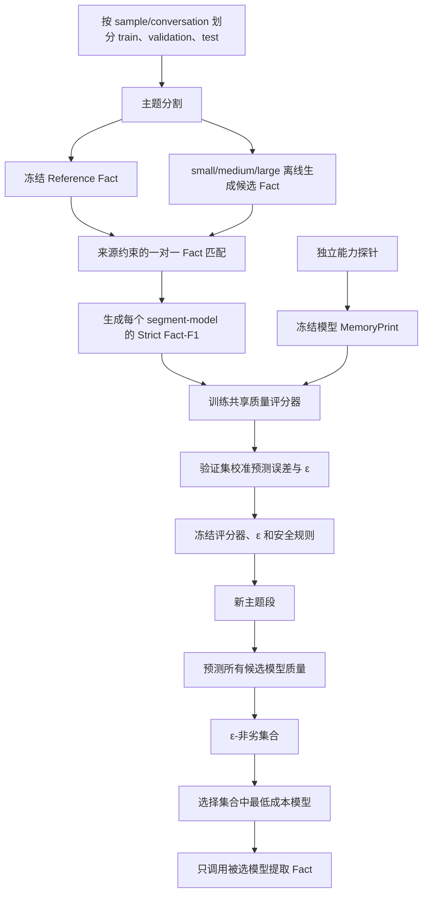

# 基于质量差距的局部模型路由完整方案

> 方案定位：不设置 sample 级硬预算，不使用 QA、Reader 或 Judge 训练路由器；针对每个主题段独立预测候选模型的 Fact 提取质量，并在预测质量接近最优时选择最低成本模型。
>
> 核心名称：质量差距路由（Quality-Gap Routing）或 \(\varepsilon\)-非劣路由（\(\varepsilon\)-Noninferiority Routing）。

## 一、方案结论

本方案将研究目标定义为：

\[
\boxed{
\text{针对每个主题段，在允许的局部质量损失范围内，选择最低成本的充分模型}
}
\]

对于主题段 \(d\) 和候选模型集合 \(\mathcal M\)，质量评分器先预测每个模型的 Fact 提取质量：

\[
\hat q_{d,m}=f_\theta(x_d,c_m),\qquad m\in\mathcal M
\]

其中：

- \(x_d\) 是主题段的语义与结构表示；
- \(c_m\) 是候选模型的冻结能力表示（MemoryPrint）；
- \(\hat q_{d,m}\) 是模型 \(m\) 处理主题段 \(d\) 时的预测 Strict Fact-F1。

设预测最优质量为：

\[
\hat q_{d,\max}=\max_{m\in\mathcal M}\hat q_{d,m}
\]

在质量容忍度 \(\varepsilon\) 下，可接受模型集合为：

\[
\mathcal A_\varepsilon(d)
=
\left\{
m\in\mathcal M:
\hat q_{d,\max}-\hat q_{d,m}\le\varepsilon
\right\}
\]

最终选择：

\[
\boxed{
m^*(d)
=
\arg\min_{m\in\mathcal A_\varepsilon(d)} cost(m)
}
\]

因此，每个主题段只由自身内容、结构、候选模型能力和预测质量决定，不受同一 sample 中其他主题段影响。

## 二、研究目标与非目标

### 2.1 研究目标

1. 预测不同候选模型处理同一主题段时能够达到的 Fact 提取质量。
2. 当便宜模型与预测最优模型的质量差距足够小时，优先选择便宜模型。
3. 当便宜模型存在明显质量劣势时，升级到 medium、large 或实际预测最优模型。
4. 在不预生成全部候选 Fact 的部署条件下，直接为每个主题段选择一个提取模型。
5. 获得可解释、可校准、可跨价格调整的局部模型路由机制。

### 2.2 明确不作为训练目标的内容

本方案不直接优化：

- sample 级总预算；
- 端到端 QA Accuracy；
- Retriever、Reader 或 Judge 性能；
- 针对某个未来问题的记忆价值；
- 所有主题段之间的全局组合最优性。

QA 可以保留为最终外部验证，但不进入：

- 路由器输入；
- 训练标签；
- 训练损失；
- checkpoint 选择标准；
- \(\varepsilon\) 的调参过程。

因此，本方案能声称的是“在局部 Fact 质量非劣约束下节约提取成本”，不能声称“在固定总预算下最大化 QA”。

## 三、为什么该方案合理

### 3.1 它消除了 sample 级耦合

全局预算优化中，同一个主题段的选择可能取决于其他主题段：

```text
sample A 中其他主题段简单 → d1 可能获得 large
sample B 中其他主题段困难 → d1 可能只能使用 small
```

本方案不设 sample 级总预算，因此路由函数为：

\[
m^*(d)=R_\varepsilon
\left(
\hat q_{d,small},
\hat q_{d,medium},
\hat q_{d,large}
\right)
\]

相同主题段、相同候选模型、相同评分器版本和相同 \(\varepsilon\) 将产生相同选择。

### 3.2 它匹配“最低充分能力”思想

如果三个模型的预测质量分别为：

\[
[0.70,0.71,0.75]
\]

并设置：

\[
\varepsilon=0.05
\]

那么：

| 模型 | 预测质量 | 与最优质量差距 | 是否在容忍范围内 |
|---|---:|---:|---:|
| small | 0.70 | 0.05 | 是 |
| medium | 0.71 | 0.04 | 是 |
| large | 0.75 | 0.00 | 是 |

三个模型都足够接近，因此选择成本最低的 small。

如果预测为：

\[
[0.70,0.71,0.76]
\]

则 small 的差距为 0.06，超过 \(\varepsilon\)；medium 的差距为 0.05，因此选择 medium，而不是直接跳到 large。

如果预测为：

\[
[0.45,0.62,0.83]
\]

则只有 large 位于容忍范围内，因此选择 large。

### 3.3 它不假设大模型永远最好

真实实验中可能出现：

\[
\hat q_{medium}>\hat q_{large}
\]

因此决策规则不应写成“差距大就固定选择 large”，而应选择“预测最优模型”或“与预测最优足够接近的最低成本模型”。

## 四、数据与标签构造

### 4.1 数据划分

必须先按 sample 或 conversation 划分：

```text
原始 sample / conversation
├── train
├── validation
└── test
```

然后在每个 split 内展开为：

```text
主题段 × 候选模型
```

禁止先展开 `(segment, model)` 再随机切分，否则同一主题段的 small 记录可能进入训练集，而 large 记录进入验证集或测试集，造成泄漏。

### 4.2 Reference Fact

对于每个主题段 \(d\)，建立冻结参考 Fact 集合：

\[
R_d=\{r_1,r_2,\ldots,r_K\}
\]

强模型生成的 Fact 默认只能称为 Reference Fact 或 Silver Fact，除非经过充分人工验证，否则不应直接称为绝对 Gold。参考集合至少需要：

- 原文 source grounding；
- 原子性检查；
- 去重；
- 时间与状态更新检查；
- 固定 Judge 对齐；
- 分层人工抽样审计。

### 4.3 候选 Fact

对训练集中的每个主题段，让所有候选模型使用相同 Prompt、Schema 和解码协议生成候选 Fact：

\[
F_{d,m}=h_m(d)
\]

例如：

```text
d → F(d, small)
d → F(d, medium)
d → F(d, large)
```

训练期需要生成全部候选 Fact，是为了构造监督标签；部署期只调用最终被路由选中的模型。

### 4.4 Strict Fact-F1 标签

将候选 Fact 与 Reference Fact 做来源约束的一对一匹配，统计：

- TP：正确、非重复且有有效来源支撑的候选 Fact；
- FP：错误、重复、无来源或来源无效的候选 Fact；
- FN：被候选模型遗漏的参考 Fact。

标签定义为：

\[
q_{d,m}
=
\frac{2TP}{2TP+FP+FN}
\]

每个主题段形成三条监督记录：

| 主题段输入 | 模型能力表示 | 监督标签 |
|---|---|---:|
| \(x_d\) | \(c_{small}\) | \(q_{d,small}\) |
| \(x_d\) | \(c_{medium}\) | \(q_{d,medium}\) |
| \(x_d\) | \(c_{large}\) | \(q_{d,large}\) |

## 五、质量评分器

### 5.1 输入表示

主题段特征：

\[
x_d=[e_d;g_d]
\]

其中：

- \(e_d\)：384 维主题段语义嵌入；
- \(g_d\)：6 维结构特征，例如 token 数、turn 数、字符数、行数、数字数和不同词语数。

模型能力表示使用冻结的 7 维 MemoryPrint：

\[
c_m=[
memory\_recall,
target\_memory\_precision,
memory\_accuracy,
current\_state\_accuracy,
target\_binding\_accuracy,
stale\_value\_rejection,
evidence\_f1
]
\]

最终输入：

\[
z_{d,m}=[x_d;c_m]
\]

当前定义下维度为：

\[
384+6+7=397
\]

### 5.2 模型输出

共享 MLP 对每个 `(segment, model)` pair 输出一个 0 到 1 的预测质量：

\[
\hat q_{d,m}
=
\operatorname{sigmoid}
\left(
\operatorname{MLP}_\theta(z_{d,m})
\right)
\]

同一个 MLP 分别与 small、medium、large 的 MemoryPrint 组合，因此同一主题段可得到三个预测值。

### 5.3 训练损失

质量评分器使用 Huber Loss：

\[
\boxed{
\mathcal L_{quality}
=
\frac{1}{|\mathcal D_{train}|\,|\mathcal M|}
\sum_{d,m}
\operatorname{Huber}
(\hat q_{d,m},q_{d,m})
}
\]

验证集使用 MAE 选择 checkpoint：

\[
MAE
=
\frac{1}{|\mathcal D_{val}|\,|\mathcal M|}
\sum_{d,m}
|\hat q_{d,m}-q_{d,m}|
\]

MemoryPrint 是冻结输入，不参与反向传播更新。

## 六、基础 \(\varepsilon\)-非劣路由规则

### 6.1 决策算法

```python
def select_model(predicted_quality, model_cost, epsilon):
    best_quality = max(predicted_quality.values())
    eligible = [
        model
        for model, quality in predicted_quality.items()
        if best_quality - quality <= epsilon
    ]
    return min(eligible, key=lambda model: model_cost[model])
```

这里的 cost 只用于确定“哪个模型更便宜”，不构成 sample 级预算约束。如果 small、medium、large 的价格顺序稳定，也可以直接使用固定成本顺序；仍建议记录真实价格快照用于评测和审计。

### 6.2 路由输出

每个主题段应保存完整决策依据：

```json
{
  "segment_id": "seg_001",
  "predicted_quality": {
    "small": 0.70,
    "medium": 0.71,
    "large": 0.75
  },
  "best_predicted_quality": 0.75,
  "epsilon": 0.05,
  "eligible_models": ["small", "medium", "large"],
  "selected_model": "small",
  "decision_reason": "cheapest_model_within_quality_tolerance"
}
```

### 6.3 不需要额外训练分类器

质量评分器加确定性决策规则已经构成完整路由器。不建议再把规则生成的 small、medium、large 标签用于训练第二个三分类 MLP，因为这样会：

- 丢失三个连续质量分数；
- 把 \(\varepsilon\) 固化进分类器；
- 改变 \(\varepsilon\) 时需要重新训练；
- 候选模型变化时需要重新定义类别；
- 降低决策可解释性和跨模型扩展性。

## 七、不确定性感知的稳健路由

### 7.1 为什么需要不确定性

如果真实质量为：

\[
[0.60,0.75,0.85]
\]

但评分器误预测为：

\[
[0.78,0.80,0.82]
\]

基础规则可能错误选择 small。因此，实际系统不应把一个未经校准的点预测差距直接当成真实质量差距。

### 7.2 基于验证残差的差距上界

在验证集上计算所有模型 pair 的真实差距和预测差距：

\[
g_{d,m}=q_{d,\max}-q_{d,m}
\]

\[
\hat g_{d,m}=\hat q_{d,\max}-\hat q_{d,m}
\]

统计预测差距低估真实差距的残差：

\[
r_{d,m}=g_{d,m}-\hat g_{d,m}
\]

设 \(r_{1-\alpha}\) 为该残差的 \((1-\alpha)\) 分位数，则保守差距上界为：

\[
g^{upper}_{d,m}
=
\hat g_{d,m}+r_{1-\alpha}
\]

稳健可接受集合：

\[
\mathcal A^{robust}_\varepsilon(d)
=
\left\{
m:g^{upper}_{d,m}\le\varepsilon
\right\}
\]

最终选择：

\[
\boxed{
m^*(d)
=
\arg\min_{m\in\mathcal A^{robust}_\varepsilon(d)}cost(m)
}
\]

如果稳健集合因校准边界过于保守而为空，则回退到预测质量最高模型。

### 7.3 可选的不确定性建模

后续可比较：

- 验证残差分位数；
- Deep Ensemble；
- MC Dropout；
- 分位数回归；
- Conformal calibration。

第一版推荐验证残差分位数，因为实现简单，不需要改变评分器结构。

## 八、低质量与 OOD 安全规则

### 8.1 所有模型质量都很低

如果预测为：

\[
[0.20,0.21,0.22]
\]

基础规则会因三者接近而选择 small。该选择在“边际提升不值得付费”的目标下是合理的，但它也说明所有候选模型都可能无法可靠处理该主题段。

建议增加最低质量门槛 \(q_{floor}\)：

```text
如果 best_predicted_quality < q_floor：
    选择预测质量最高模型，或标记为 low-confidence / fallback-required
否则：
    应用 ε-非劣规则
```

具体采用“选择最好模型”还是“触发外部 fallback”，需要根据部署系统是否允许人工或更强模型介入决定。

### 8.2 新模型或新数据 OOD

对于训练时未见的模型或明显偏离训练分布的主题段：

- 新模型必须先运行相同定义的 MemoryPrint 探针；
- 检查能力表示是否处于训练分布内；
- OOD 严重时禁止激进降级到便宜模型；
- 可回退到预测最优模型或人工指定模型；
- 将 OOD 数据纳入下一周期校准，而不是在线直接修改正式路由器。

## 九、\(\varepsilon\) 的选择与校准

### 9.1 \(\varepsilon\) 的含义

\(\varepsilon\) 是允许便宜模型相对预测最优模型损失的最大 Strict Fact-F1：

| \(\varepsilon\) | 路由倾向 |
|---:|---|
| 0 | 只选择预测质量最高模型 |
| 0.01 | 极保守降级 |
| 0.03 | 中等降级 |
| 0.05 | 更积极选择便宜模型 |
| 0.10 | 强成本优先 |

表中数值仅表示实验扫描范围，不应在看到测试结果后选择。

### 9.2 验证集扫描

在验证集扫描：

\[
\varepsilon\in\{0,0.01,0.02,\ldots,0.15\}
\]

对每个 \(\varepsilon\) 计算：

- 实际平均 Strict Fact-F1；
- 平均实际成本；
- 相对真实最优模型的质量 regret；
- 超过允许质量损失的比例；
- small、medium、large 的选择比例；
- 对预测误差和 OOD 的敏感性。

真实局部 regret 定义为：

\[
Regret_d
=
\max_m q_{d,m}-q_{d,m^*(d)}
\]

平均 regret：

\[
MeanRegret
=
\frac{1}{N}\sum_d Regret_d
\]

质量非劣违反率：

\[
ViolationRate(\delta)
=
\frac{1}{N}
\sum_d
\mathbb 1(Regret_d>\delta)
\]

可以预先声明选择标准，例如选择满足以下约束的最大 \(\varepsilon\)：

\[
MeanRegret\le0.02
\]

并且：

\[
ViolationRate(0.05)\le5\%
\]

这些阈值只是示例，正式实验必须在查看测试结果之前冻结。

### 9.3 测试集纪律

测试前必须冻结：

- 评分器 checkpoint；
- 特征 scaler；
- MemoryPrint 版本；
- Reference Fact 协议；
- \(\varepsilon\)；
- 残差校准分位数；
- \(q_{floor}\)；
- tie-break 规则；
- 成本快照。

测试集只用于最终报告，不能继续调整 \(\varepsilon\)。

## 十、完整训练与部署流程



### 10.1 训练阶段

```text
1. 按 sample/conversation 划分数据。
2. 对每个主题段冻结 Reference Fact。
3. small/medium/large 生成候选 Fact。
4. 计算每个 `(segment, model)` 的 Strict Fact-F1。
5. 独立生成并冻结每个模型的 MemoryPrint。
6. 训练共享质量 MLP。
7. 在 validation 上校准预测残差。
8. 扫描 ε，选择预声明约束下的操作点。
9. 冻结 checkpoint、ε、残差边界和安全规则。
```

### 10.2 部署阶段

```text
1. 对新对话执行主题分割。
2. 对每个主题段构造语义和结构特征。
3. 分别拼接每个候选模型的 MemoryPrint。
4. 质量评分器输出所有候选模型的预测 Fact-F1。
5. 应用 OOD、低质量和不确定性安全检查。
6. 计算 ε-非劣可接受模型集合。
7. 选择可接受集合中的最低成本模型。
8. 只调用选中的模型提取 Fact。
9. 持久化 Fact、预测质量、路由原因和实际成本。
```

## 十一、评测方案

### 11.1 质量预测指标

- MAE；
- RMSE；
- Spearman 相关系数；
- 候选模型 pairwise 排序准确率；
- 分模型、分数据集和分主题段难度的校准误差。

### 11.2 路由决策指标

- 路由后实际平均 Strict Fact-F1；
- Mean Regret；
- P50/P90/P95 Regret；
- \(ViolationRate(\delta)\)；
- small、medium、large 选择比例；
- 相对 All-large 的成本节省率；
- 相对真实 \(\varepsilon\)-Oracle 的选择一致率；
- OOD 和低置信样本的回退率。

成本节省率可定义为：

\[
CostSaving
=
1-
\frac{\sum_d cost(m^*(d))}
{\sum_d cost(large)}
\]

### 11.3 必要基线

至少比较：

1. All-small；
2. All-medium；
3. All-large；
4. Random；
5. Argmax predicted quality，即 \(\varepsilon=0\)；
6. 基础 \(\varepsilon\)-非劣路由；
7. 不确定性感知 \(\varepsilon\)-非劣路由；
8. True-quality \(\varepsilon\)-Oracle：直接使用真实 Fact-F1 执行相同规则，仅作为上界；
9. 全局预算优化器：作为扩展场景对照，不作为本方案主方法。

### 11.4 消融实验

- 去掉 MemoryPrint；
- 去掉结构特征；
- 只用主题段 embedding；
- 点预测规则与不确定性规则；
- 不同 \(\varepsilon\)；
- 有无 \(q_{floor}\)；
- 固定模型池与 leave-one-model-out；
- 同家族与 leave-one-family-out；
- 绝对差距阈值与相对差距阈值。

## 十二、绝对阈值与相对阈值

主方案推荐绝对 Strict Fact-F1 差距：

\[
\hat q_{\max}-\hat q_m\le\varepsilon_{abs}
\]

也可实验相对差距：

\[
\frac{\hat q_{\max}-\hat q_m}
{\max(\hat q_{\max},\delta)}
\le\varepsilon_{rel}
\]

绝对阈值更容易解释，例如“最多接受 0.03 Fact-F1 损失”；相对阈值在总体质量很低时可能放大微小绝对差异。正式主结果应预先指定一种，另一种作为消融。

## 十三、推荐工件

### 13.1 质量标签

```json
{
  "dataset": "locomo",
  "split": "train",
  "sample_id": "sample_001",
  "segment_id": "seg_001",
  "model_id": "small-model-id",
  "profile_id": "small-memoryprint-v1",
  "silver_strict_fact_f1": 0.70,
  "label_protocol_version": "strict_fact_f1_v1"
}
```

### 13.2 路由配置

```yaml
decision:
  mode: "quality_gap"
  epsilon: 0.05
  tie_breaker: "minimum_cost"
  quality_floor: 0.30
  low_quality_action: "predicted_best"
  uncertainty:
    enabled: true
    method: "validation_gap_residual_quantile"
    confidence: 0.95
  ood_action: "predicted_best"
```

### 13.3 路由记录

```json
{
  "dataset": "locomo",
  "split": "test",
  "sample_id": "sample_101",
  "segment_id": "seg_007",
  "predicted_quality": {
    "small-model-id": 0.70,
    "medium-model-id": 0.71,
    "large-model-id": 0.75
  },
  "predicted_gap": {
    "small-model-id": 0.05,
    "medium-model-id": 0.04,
    "large-model-id": 0.0
  },
  "gap_upper_bound": {
    "small-model-id": 0.05,
    "medium-model-id": 0.04,
    "large-model-id": 0.0
  },
  "epsilon": 0.05,
  "eligible_model_ids": [
    "small-model-id",
    "medium-model-id",
    "large-model-id"
  ],
  "selected_model_id": "small-model-id",
  "decision_reason": "cheapest_model_within_quality_tolerance",
  "quality_checkpoint_hash": "...",
  "capability_profile_hash": "...",
  "price_snapshot_hash": "..."
}
```

## 十四、与当前仓库的关系

当前仓库已经具备以下基础模块：

- Reference Fact 与候选 Fact 标签构造；
- `silver_strict_fact_f1` 标签；
- 主题段 embedding 与结构特征；
- 7 维 MemoryPrint；
- 共享标量质量评分器；
- Huber Loss 训练；
- 预测质量与成本工件。

本方案现已在独立包 `infobudget.quality_gap_router` 中实现，包括：

1. 基础与不确定性感知的 `quality_gap` 路由规则；
2. \(\varepsilon\) 扫描与验证集约束选择；
3. pairwise gap 残差分位数校准；
4. `quality_floor` 与可选 OOD 标记回退；
5. 路由 regret、违反率、True-\(\varepsilon\)-Oracle 一致率和成本节省评测；
6. 严格的 prediction/label/cost 工件连接与校验。

可执行入口为：

```text
scripts/route_with_quality_gap.py
scripts/calibrate_quality_gap.py
scripts/evaluate_quality_gap_router.py
```

默认参数位于 `configs/quality_gap_router.yaml`，核心单元测试位于
`tests/test_quality_gap_router.py`。

尚未生成的是依赖真实实验数据的训练工件，包括 Reference Fact、候选 Fact、
`fact_quality_labels.jsonl`、MemoryPrint profile、质量评分器 checkpoint 和正式
validation/test 路由结果。这些工件必须通过冻结的数据划分和实验协议实际运行后产生。

原有预算优化器保留，不删除，用作可选扩展和实验基线。

## 十五、实施顺序

### 阶段 A：最小可行版本

1. 完成真实 `silver_strict_fact_f1` 标签。
2. 训练并验证质量评分器。
3. 实现基础 \(\varepsilon\)-非劣规则。
4. 在 validation 扫描 \(\varepsilon\)。
5. 报告 Fact-F1、regret、成本和模型选择比例。

### 阶段 B：稳健性增强

1. 增加预测差距残差校准。
2. 增加 `quality_floor`。
3. 增加 OOD 检查。
4. 执行 leave-one-model-out 和 leave-one-family-out。

### 阶段 C：外部验证

1. 冻结路由器和 \(\varepsilon\)。
2. 在测试集执行实际路由和 Fact 提取。
3. 以 Fact 质量—成本曲线作为主结果。
4. 可选执行 QA 外部验证，但 QA 结果不反向修改主方案。

## 十六、适用边界与风险

### 16.1 不提供硬成本上限

如果所有主题段都明显需要 large，本方案可能对所有主题段选择 large。因此它不能保证某个 sample 的总成本不超过指定金额。

如果生产环境未来必须满足硬预算，可以在本方案之外增加：

- sample 级预算优化；
- 每日或每请求配额；
- 超预算时的安全降级规则。

这些属于部署约束扩展，不改变局部质量评分器本身。

### 16.2 依赖质量评分器校准

路由决策由模型间的预测差距驱动，因此“差距预测是否可靠”比单独的绝对 MAE 更重要。必须报告 pairwise gap error 和实际 regret，不能只报告验证 MAE。

### 16.3 Reference Fact 不完备

如果 Reference Fact 漏掉真实事实，正确候选 Fact 可能被误判为 FP；如果 Reference Fact 本身存在幻觉，所有候选模型都会受到错误监督。因此参考集合质量是本方案的主要标签风险。

### 16.4 不直接保证 QA 改善

Fact-F1 提升不等于 QA 一定提升。本方案只优化记忆提取质量。QA 结果如被报告，应被描述为外部迁移验证，而不是路由器直接优化的训练目标。

## 十七、最终研究表述

建议将最终方法描述为：

> 本方法训练一个能力条件化的共享质量评分器，根据主题段的语义与结构表示以及候选模型的冻结 MemoryPrint，预测每个候选模型在该主题段上的 Strict Fact-F1。部署时不设置 sample 级全局预算，而采用 \(\varepsilon\)-非劣决策：在预测质量距离最优值不超过预设容忍度的候选模型中，选择成本最低的模型。该方法使每个主题段能够独立、可解释地路由到最低充分能力模型，并通过验证集校准的质量差距边界控制错误降级风险。

核心公式为：

\[
\boxed{
m^*(d)
=
\arg\min_m cost(m)
\quad
\text{s.t.}
\quad
\max_k\hat q_{d,k}-\hat q_{d,m}\le\varepsilon
}
\]

稳健版本为：

\[
\boxed{
m^*(d)
=
\arg\min_m cost(m)
\quad
\text{s.t.}
\quad
g^{upper}_{d,m}\le\varepsilon
}
\]

本方案的主结果应是：

\[
\boxed{
\text{Fact 质量}
\;\text{--}\;
\text{实际成本}
\;\text{--}\;
\text{局部 regret}
}
\]

而不是 sample 级预算满足率或 QA reward。
