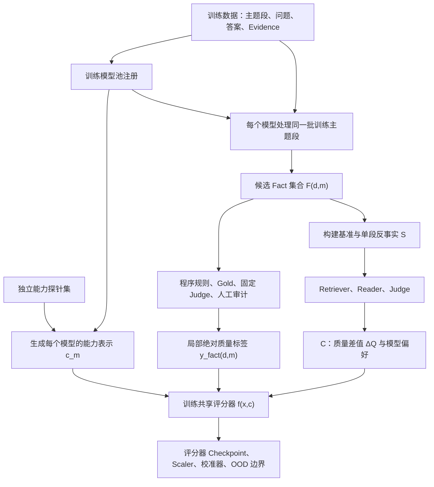
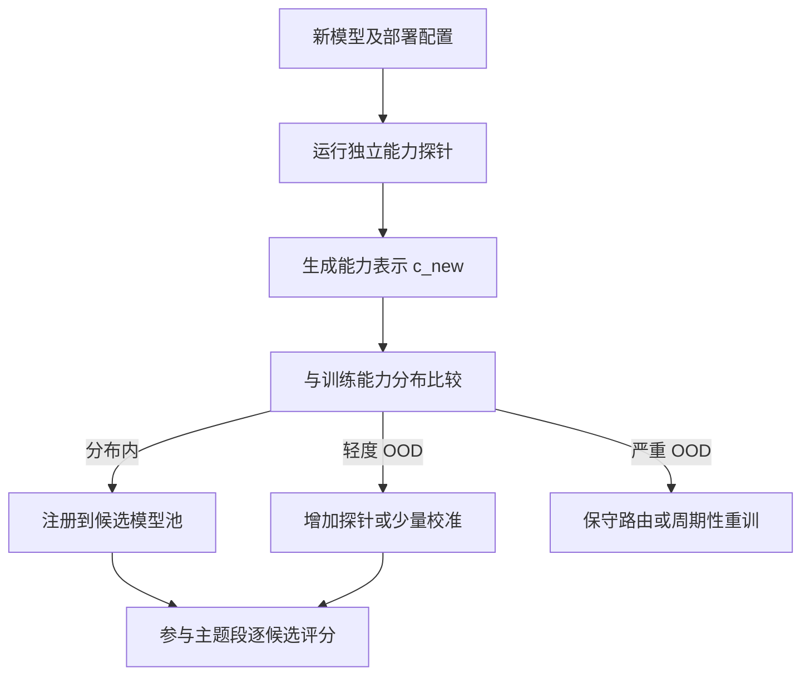
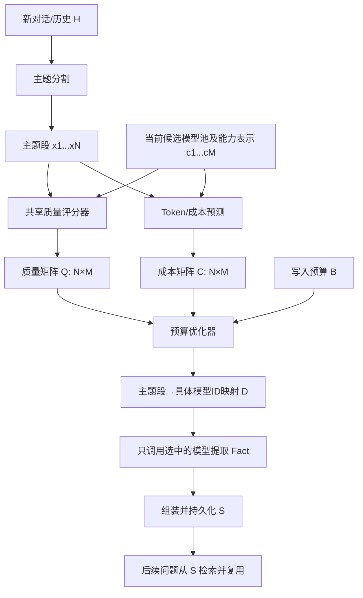

结论是：

> 这种方法可以训练出“结构上通用、统计上有条件通用”的路由器，但不能保证对任意新模型、任意新家族都天然可靠。

它的通用性来源于：

\[
f_\theta(x_d,c_m)\rightarrow \hat{\mathbf y}_{d,m}
\]

而不是：

\[
x_d\rightarrow\{\text{small},\text{medium},\text{large}\}
\]

其中模型能力 \(c_m\) 必须作为每个候选模型的输入。它不是路由器要预测的类别标签，而是候选模型的条件特征。

---

# 一、这种路由器具有哪种“通用性”

| 通用性 | 是否具备 | 条件 |
|---|---|---|
| 候选模型数量可变 | 是，结构上支持 | 对每个 `(主题段, 模型)` 独立评分 |
| 模型顺序可变 | 是 | 共享评分函数，不使用固定输出位置 |
| 价格变化 | 是 | 价格不进入质量模型，只进入预算优化器 |
| 同家族新模型 | 有条件支持 | 新模型完成能力探针，且能力表示处于训练分布内 |
| 未见模型家族 | 有可能，但必须实验证明 | 多家族训练、leave-one-family-out 测试、OOD 检查 |
| 任意新模型完全零样本 | 不保证 | 没有行为探针就无法可靠了解新模型能力 |
| 任意新任务 | 不具备 | 当前能力指纹针对长期记忆 Fact 提取任务 |
| 任意 Retriever/Reader/Judge | 不具备 | 更换下游组件会改变 QA 效用分布，需要重新校准 |

因此更准确的论文表述是：

> 这是一个面向长期记忆 Fact 提取任务的、能力条件化的动态模型池路由器。

而不是：

> 这是一个对任意模型和任意任务都通用的路由器。

---

# 二、为什么局部标签和 C 反事实标签必须同时存在

这两类标签解决的问题不同。

## 1. 局部 Fact 标签提供绝对刻度

例如：

\[
\mathbf y^{fact}_{d,m}
=
[
precision,
recall,
faithfulness,
current\_state,
binding,
stale\_rejection,
evidence\_F1
]
\]

它告诉路由器：

> 模型 \(m\) 对主题段 \(d\) 的实际提取质量是多少。

例如：

```text
seg_008 + qwen-small:
  fact_quality = 0.52

seg_008 + qwen-medium:
  fact_quality = 0.78
```

## 2. C 提供模型间的相对差异

例如：

```text
把 seg_008 从 small 替换为 medium
使相关 QA 正确率提高 0.15
```

它告诉路由器：

\[
f(x_d,c_{medium})
-
f(x_d,c_{small})
\approx0.15
\]

或者：

\[
(x_d,c_{medium})
\succ
(x_d,c_{small})
\]

## 3. 为什么不能只使用 C

如果只使用差值：

\[
f(x_d,c_{medium})-f(x_d,c_{small})=0.15
\]

那么以下预测都满足条件：

```text
small = 0.10, medium = 0.25
small = 0.50, medium = 0.65
small = 0.80, medium = 0.95
```

它们排序相同，但绝对质量完全不同。

数学上，对所有模型分数同时加上任意常数 \(k(x_d)\)：

\[
f'(x_d,c_m)=f(x_d,c_m)+k(x_d)
\]

模型间差值不变。

所以：

- C 负责排序和下游边际增益；
- 局部 Fact 标签负责绝对质量和概率校准；
- 两者结合才能得到既能排序、又能估计质量的评分器。

---

# 三、是否包含“模型能力标签”

需要区分三个概念。

## 1. 模型能力表示：输入

\[
c_m=\Psi(m)
\]

它是模型在独立能力探针集上的表现，例如：

```json
{
  "model_profile_id": "qwen-medium-extractor-v1",
  "model_family": "qwen",
  "memoryprint": {
    "fact_recall": 0.81,
    "target_precision": 0.77,
    "faithfulness": 0.91,
    "current_state": 0.74,
    "target_binding": 0.83,
    "stale_rejection": 0.70,
    "evidence_f1": 0.79
  },
  "conditional_fingerprint": {
    "temporal_update": 0.73,
    "multi_person": 0.82,
    "chinese": 0.88,
    "english": 0.79
  },
  "uncertainty": {
    "fact_recall_se": 0.03,
    "current_state_se": 0.06
  },
  "profile_mask": {
    "fact_recall": 1,
    "current_state": 1
  }
}
```

它要输入路由器。

## 2. 局部质量标签：训练目标

\[
\mathbf y^{fact}_{d,m}
\]

例如：

```json
{
  "segment_id": "seg_008",
  "model_profile_id": "qwen-medium-extractor-v1",
  "local_quality": {
    "precision": 0.75,
    "recall": 0.80,
    "faithfulness": 1.0,
    "current_state": 1.0,
    "stale_rejection": 0.0,
    "evidence_f1": 0.67
  }
}
```

它是监督标签。

## 3. C 中的反事实标签：辅助训练目标

\[
\Delta Q_{d,m_1,m_0}
\]

例如：

```json
{
  "segment_id": "seg_008",
  "baseline_model_profile_id": "qwen-small-extractor-v1",
  "candidate_model_profile_id": "qwen-medium-extractor-v1",
  "delta_quality": 0.15,
  "preferred_model": "qwen-medium-extractor-v1",
  "confidence": 0.82
}
```

它也是监督信号，但监督的是两个模型分数的差值和排序。

所以答案是：

> 使用路由时必须包含模型能力表示；但“模型能力”不是最终分类标签。路由器的训练标签是局部 Fact 质量、C 中的反事实质量差和模型偏好。

---

# 四、模型能力表示是如何生成的

能力向量不能通过模型名称硬编码，例如不能简单写：

```text
qwen-small  -> [0, 0, 1]
qwen-medium -> [0, 1, 0]
qwen-large  -> [1, 0, 0]
```

否则仍然只是模型 ID。

应使用独立能力探针集：

\[
\mathcal A=
\{(x_j,G_j,t_j)\}_{j=1}^{N_A}
\]

每个候选模型都在相同探针集上运行：

```text
候选模型
  -> 固定 Fact 提取 Prompt
  -> 固定 Schema
  -> 能力探针集
  -> Gold/Judge 评价
  -> 聚合成 MemoryPrint
```

能力探针应覆盖：

- 简单事实；
- 多人物绑定；
- 指代消解；
- 时间表达；
- 知识更新；
- 旧值拒绝；
- 否定和取消；
- 中文、英文和中英混合；
- 跨句事实组合；
- 无记忆事实时返回空集。

能力表示必须与最终训练和测试数据隔离，不能用最终测试集计算新模型的能力指纹，否则会产生泄漏。

项目文档已经明确将模型能力定义为条件输入，而不是训练目标，[模型能力条件化方案](/S:/Workfile/InfoBudget2/docs/模型能力条件化质量训练与预算控制整体方案.md:175)。

---

# 五、训练阶段完整流程



## 阶段 0：冻结实验协议

### 输入

- Fact 提取 Prompt；
- 输出 Schema；
- Retriever；
- embedding 模型；
- Reader；
- Judge；
- 数据划分；
- 质量指标定义。

### 输出

```json
{
  "protocol_version": "capability_router_v1",
  "extraction_prompt_hash": "...",
  "retriever_hash": "...",
  "reader_prompt_hash": "...",
  "judge_prompt_hash": "...",
  "split_manifest_hash": "..."
}
```

这些组件在标签生成期间不能随意变化，否则前后标签不在同一尺度上。

---

## 阶段 1：生成模型能力表示

### 输入

对每个训练模型 \(m\)：

```text
模型配置
+ 固定提取 Prompt
+ 独立能力探针集
+ Gold/固定 Judge
```

### 输出

```text
model_capability_profiles.json
```

每个模型对应：

\[
c_m=
[
MemoryPrint,
conditional\_fingerprint,
static\_configuration,
uncertainty,
mask
]
\]

这里可以保留：

- 模型 ID，用于审计；
- 模型家族，用于分组评估；
- 参数量和量化方式，用于弱先验；
- 但不建议把模型 ID 作为可学习的类别特征。

---

## 阶段 2：生成所有候选 Fact

对所有训练主题段和训练模型：

\[
F_{d,m}=h_m(x_d)
\]

### 输入

```json
{
  "segment_id": "seg_008",
  "segment_text": "...",
  "candidate_model_id": "qwen-medium",
  "extraction_prompt_version": "..."
}
```

### 输出

```json
{
  "segment_id": "seg_008",
  "model_profile_id": "qwen-medium-extractor-v1",
  "facts": [
    {
      "fact_id": "f1",
      "fact_text": "...",
      "source_ids": [4, 7]
    }
  ],
  "token_usage": {},
  "cost_snapshot": {}
}
```

训练时需要让多个模型尽量处理同一批主题段，才能公平比较模型差异。

---

## 阶段 3：生成局部绝对质量标签

### 输入

- 原始主题段；
- 候选 Fact；
- Gold/Silver reference facts；
- Gold evidence；
- 固定 Fact Judge；
- 程序规则。

### 输出

```text
local_fact_quality_labels.jsonl
```

一行对应一个 `(segment, model)`：

\[
(x_d,c_m,\mathbf y^{fact}_{d,m})
\]

例如：

```json
{
  "segment_id": "seg_008",
  "model_profile_id": "qwen-medium-extractor-v1",
  "labels": {
    "precision": 0.75,
    "recall": 0.80,
    "faithfulness": 1.0,
    "current_state": 1.0,
    "target_binding": 1.0,
    "stale_rejection": 0.0,
    "evidence_f1": 0.67
  },
  "label_mask": {
    "precision": 1,
    "recall": 1,
    "faithfulness": 1,
    "current_state": 1,
    "target_binding": 1,
    "stale_rejection": 1,
    "evidence_f1": 1
  },
  "label_confidence": {},
  "label_sources": {}
}
```

---

## 阶段 4：生成 C 反事实标签

### 输入

- 当前基准路由；
- 冻结 L/M/H 候选库；
- 主题段相关问题集合 \(Q_d\)；
- 固定 Retriever、Reader 和 Judge。

### 操作

只替换一个主题段的模型：

\[
m_0\rightarrow m_1
\]

### 输出

```text
counterfactual_effects.jsonl
```

包括：

\[
\Delta Q_{d,m_1,m_0}
\]

以及：

\[
m_1\succ m_0
\]

或：

\[
m_1\approx m_0
\]

---

## 阶段 5：组装训练样本

最终至少有三种训练记录。

### 点式绝对质量样本

```json
{
  "segment": "x_d",
  "candidate_model_profile": "c_m",
  "target_local_quality": "y_fact_d_m"
}
```

### 成对差值样本

```json
{
  "segment": "x_d",
  "model_profile_a": "c_m0",
  "model_profile_b": "c_m1",
  "target_delta_quality": 0.15
}
```

### 问题级组合样本

```json
{
  "question_id": "q1",
  "evidence_segment_ids": ["d1", "d2"],
  "route": {
    "d1": "model_a",
    "d2": "model_b"
  },
  "judge_correct": true
}
```

---

## 阶段 6：训练共享评分器

输入编码：

\[
h_d=E_x(x_d)
\]

\[
e_m=E_c(c_m)
\]

共享评分器：

\[
\hat{\mathbf y}_{d,m}
=
f_\theta(h_d,e_m)
\]

推荐同时输出：

```json
{
  "predicted_quality": {
    "precision": 0.77,
    "recall": 0.73,
    "faithfulness": 0.91,
    "current_state": 0.84,
    "target_binding": 0.88,
    "stale_rejection": 0.76,
    "evidence_f1": 0.79
  },
  "predicted_uncertainty": {
    "precision": 0.04,
    "recall": 0.07
  }
}
```

综合质量可以通过预先声明的权重计算：

\[
\hat q_{d,m}
=
\sum_k w_k(x_d)\hat y_{d,m,k}
\]

训练损失：

\[
\mathcal L
=
\mathcal L_{\text{local-fact}}
+
\eta\mathcal L_{\Delta}
+
\gamma\mathcal L_{\text{rank}}
+
\beta\mathcal L_{\text{QA}}
+
\rho\mathcal L_{\text{calibration}}
\]

价格不进入该损失。

---

## 阶段 7：模型级泛化验证

必须至少进行：

- `leave-one-model-out`；
- `leave-one-family-out`；
- 新模型 probe 数量消融；
- 无能力向量消融；
- 只有模型静态属性消融；
- 只有七维 MemoryPrint；
- MemoryPrint + 条件行为指纹；
- OOD 校准；
- 相对 Oracle regret；
- quality–cost frontier。

如果只在 Qwen-small/medium/large 上训练和测试，只能证明固定 Qwen 池有效，不能证明跨家族通用。

---

# 六、新模型接入流程

训练完成后，评分器冻结。

假设出现一个训练时未见的 Llama 模型。



## 输入

```json
{
  "model_id": "llama-new",
  "model_family": "llama",
  "prompt_version": "...",
  "chat_template_hash": "...",
  "quantization": "bf16",
  "decoding": {
    "temperature": 0.0
  },
  "probe_set_version": "memory_aptitude_v1"
}
```

## 输出

```json
{
  "model_profile_id": "llama-new-extractor-v1",
  "capability_vector": [],
  "conditional_fingerprint": {},
  "uncertainty": {},
  "ood_score": 0.18,
  "registration_status": "accepted"
}
```

如果 OOD 分数过高：

```json
{
  "registration_status": "calibration_required"
}
```

此时不能强行宣称零样本可靠。

项目设计也要求新模型运行能力探针、生成能力表示并检查 OOD，[模型能力条件化方案](/S:/Workfile/InfoBudget2/docs/模型能力条件化质量训练与预算控制整体方案.md:904)。

---

# 七、部署时使用路由器的完整流程

训练期会预生成所有模型候选 Fact，以便构造监督；真实部署期不能先让所有模型都提取一遍，否则路由失去节省成本的意义。

真实部署流程如下。



## 第一步：主题分割

### 输入

```json
{
  "sample_id": "sample_new",
  "conversation_history": [...]
}
```

### 输出

```json
{
  "segments": [
    {
      "segment_id": "seg_001",
      "segment_text": "...",
      "token_count": 620,
      "turn_ids": [1, 2, 3]
    }
  ]
}
```

---

## 第二步：加载候选模型池

### 输入

当前允许使用的模型：

```json
{
  "candidate_models": [
    {
      "model_profile_id": "qwen-small-extractor-v1",
      "capability_vector": [],
      "price": {}
    },
    {
      "model_profile_id": "llama-new-extractor-v1",
      "capability_vector": [],
      "price": {}
    }
  ]
}
```

候选池可以有两个、三个、五个或者更多模型。

---

## 第三步：构造所有主题段—模型 pair

假设有 \(N\) 个主题段、\(M\) 个候选模型：

\[
\mathcal P=
\{(x_d,c_m):d=1,\ldots,N;m=1,\ldots,M\}
\]

### 路由质量模型的输入

```json
{
  "segment": {
    "segment_id": "seg_001",
    "text_embedding": [],
    "numeric_features": {
      "token_count": 620,
      "turn_count": 3,
      "entity_density": 0.12,
      "temporal_signal": 1,
      "update_signal": 0
    }
  },
  "candidate_model": {
    "model_profile_id": "llama-new-extractor-v1",
    "capability_vector": [],
    "conditional_fingerprint": {},
    "uncertainty": {},
    "profile_mask": {}
  }
}
```

这里包含模型能力表示，但不包含：

- 当前模型价格；
- 训练时的 small/medium/large 标签；
- 问题答案；
- Judge 标签；
- 测试 evidence。

---

## 第四步：质量评分器输出

对于每个 pair：

\[
(x_d,c_m)
\rightarrow
(\hat{\mathbf y}_{d,m},\hat\sigma_{d,m})
\]

例如：

```json
{
  "segment_id": "seg_001",
  "model_profile_id": "llama-new-extractor-v1",
  "predicted_quality": {
    "precision": 0.78,
    "recall": 0.82,
    "faithfulness": 0.93,
    "current_state": 0.71,
    "target_binding": 0.85,
    "stale_rejection": 0.69,
    "evidence_f1": 0.76
  },
  "overall_quality": 0.81,
  "quality_uncertainty": 0.06,
  "quality_lcb": 0.75
}
```

全部 pair 构成质量矩阵：

\[
Q=
\begin{bmatrix}
\hat q_{1,1}&\hat q_{1,2}&\cdots&\hat q_{1,M}\\
\hat q_{2,1}&\hat q_{2,2}&\cdots&\hat q_{2,M}\\
\vdots&\vdots&\ddots&\vdots\\
\hat q_{N,1}&\hat q_{N,2}&\cdots&\hat q_{N,M}
\end{bmatrix}
\]

项目设计中也区分了质量预测器输出和最终路由器输出，[模型能力条件化方案](/S:/Workfile/InfoBudget2/docs/模型能力条件化质量训练与预算控制整体方案.md:694)。

---

## 第五步：预测成本

成本模型输入：

```text
主题段 token/结构
+ 候选模型 tokenizer
+ 预计输出长度
+ 当前价格表
```

输出：

```json
{
  "segment_id": "seg_001",
  "model_profile_id": "llama-new-extractor-v1",
  "predicted_input_tokens": 850,
  "predicted_output_tokens": 210,
  "predicted_cost": 0.0034
}
```

全部候选构成成本矩阵：

\[
C\in\mathbb R^{N\times M}
\]

价格可以随时更新，不需要重训质量预测器。

---

## 第六步：预算优化

输入：

```json
{
  "quality_matrix": "...",
  "cost_matrix": "...",
  "write_budget": 0.5,
  "risk_coefficient": 1.0
}
```

优化目标：

\[
\max_{a_1,\ldots,a_N}
\sum_d
\left(
\hat q_{d,a_d}
-
\kappa\hat\sigma_{d,a_d}
\right)
\]

约束：

\[
\sum_d C_{d,a_d}\le B
\]

输出：

```json
{
  "sample_id": "sample_new",
  "budget": 0.5,
  "predicted_total_cost": 0.43,
  "predicted_total_quality": 0.84,
  "route": [
    {
      "segment_id": "seg_001",
      "selected_model_profile_id": "qwen-small-extractor-v1",
      "predicted_quality": 0.79,
      "predicted_cost": 0.0012
    },
    {
      "segment_id": "seg_002",
      "selected_model_profile_id": "llama-new-extractor-v1",
      "predicted_quality": 0.91,
      "predicted_cost": 0.0043
    }
  ]
}
```

这里输出的是具体模型 ID，不是抽象的 small/medium/large。

---

## 第七步：执行实际 Fact 提取

只调用每个主题段被选中的模型：

```text
seg_001 -> qwen-small
seg_002 -> llama-new
seg_003 -> qwen-medium
```

### 输入

```json
{
  "segment_id": "seg_002",
  "segment_text": "...",
  "selected_model_id": "llama-new",
  "extraction_prompt": "..."
}
```

### 输出

```json
{
  "segment_id": "seg_002",
  "extractor_model": "llama-new",
  "facts": [
    {
      "fact_id": "...",
      "fact_text": "...",
      "source_ids": [7, 8]
    }
  ],
  "actual_tokens": {},
  "actual_cost": 0.0041
}
```

---

## 第八步：组装并持久化 S

将被选模型产生的 Fact 写入 S：

```json
{
  "assembly_id": "...",
  "sample_id": "sample_new",
  "route": {
    "seg_001": "qwen-small-extractor-v1",
    "seg_002": "llama-new-extractor-v1"
  },
  "point_count": 37,
  "status": "ready"
}
```

每个主题段在一个 assembly 中只对应一个模型。

---

## 第九步：后续 QA 复用

后续问题到来时：

```text
Question
  -> 从固定 S 检索 Top-K Fact
  -> Reader 回答
  -> 可选 Judge/反馈
```

不再重新路由历史主题段，也不重新调用所有候选提取模型。

---

## 第十步：部署监控

记录：

- 预测成本与实际成本差；
- 预测质量和后续 QA 表现；
- 新模型 OOD 分数；
- 模型能力漂移；
- 模型版本、Prompt 或量化方式变化；
- 路由选择频率；
- 大模型集中率；
- 预算违反率。

这些新数据可以进入下一周期训练，但不能在线直接修改正式路由器，除非采用经过验证的在线学习协议。

---

# 八、训练与部署的输入输出汇总

| 阶段 | 输入 | 输出 |
|---|---|---|
| 能力指纹生成 | 模型 + 独立探针 + Gold/Judge | 模型能力表示 \(c_m\) |
| 候选提取 | 主题段 \(x_d\) + 模型 \(m\) | 候选 Fact \(F_{d,m}\) |
| 局部质量评价 | Fact + Gold/Silver/Judge | 绝对标签 \(y^{fact}_{d,m}\) |
| C 反事实评价 | 基准 S + 单段替换 S + 问题 | \(\Delta Q\)、偏好、置信度 |
| 评分器训练 | \(x_d,c_m,y^{fact},\Delta Q\) | 质量评分器 checkpoint |
| 新模型接入 | 新模型 + 独立探针 | \(c_{new}\)、OOD 状态 |
| 部署质量预测 | \(x_d+c_m\) | \(\hat q_{d,m},\hat\sigma_{d,m}\) |
| 成本预测 | 主题段 + tokenizer + 价格 | \(C_{d,m}\) |
| 预算优化 | 质量矩阵 + 成本矩阵 + 预算 | 主题段→具体模型 ID |
| 实际提取 | 主题段 + 被选模型 | Fact |
| 持久化 | Fact + route provenance | S assembly |

---

# 九、最终回答

这种路由器可以具有通用性质，但必须满足以下条件：

1. 路由输入是“主题段 + 单个候选模型能力表示”；
2. 同一个共享评分器评价所有候选模型；
3. 训练标签是局部 Fact 质量和 C 中的反事实差值/偏好；
4. 候选模型数量不固定；
5. 模型价格与质量预测解耦；
6. 新模型先运行独立能力探针；
7. 对新模型进行 OOD 检查；
8. 通过 leave-one-model-out 和 leave-one-family-out 实验证明泛化；
9. 能力探针、训练数据和最终测试集严格隔离；
10. 严重 OOD 的新模型需要少量校准或重新训练。

模型能力表示在全流程中的位置是：

\[
\boxed{
\text{主题段 }x_d
+
\text{候选模型能力 }c_m
\rightarrow
\text{该模型的预测质量 }\hat y_{d,m}
}
\]

它包含模型能力信息，但不把能力当作最终类别标签。最终路由输出也不是 `small/medium/large`，而是：

\[
\boxed{
\text{segment\_id}
\rightarrow
\text{selected concrete model\_profile\_id}
}
\]

这才是能够支持动态候选模型池和跨家族接入的完整形式。
